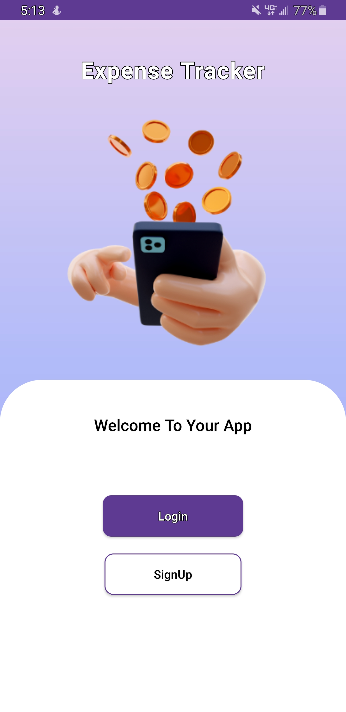
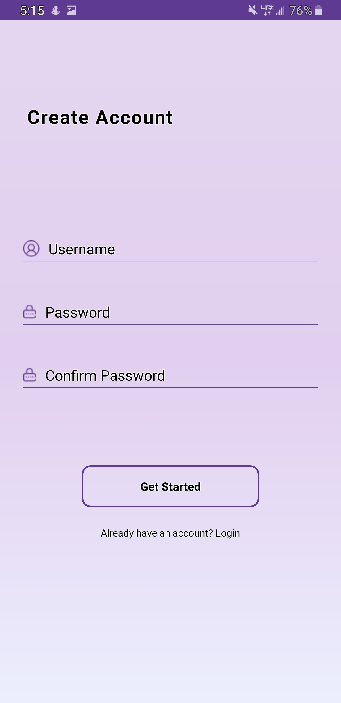
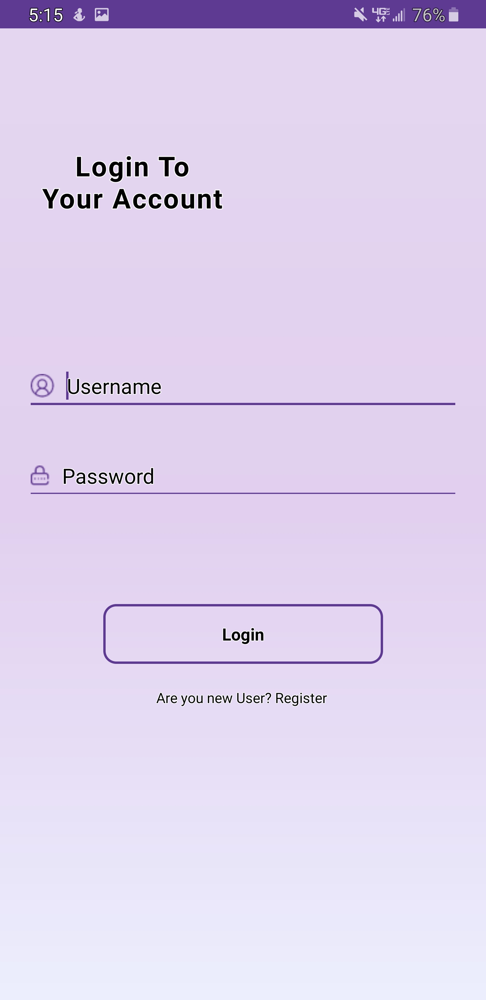

## Expense Tracker

### Description

The Expense Tracker app is an advanced solution designed to demonstrate the implementation of the Room database and MVVM architecture in Android development. This app focuses on creating, managing, and tracking expenses and incomes with a user-friendly interface. It allows users to efficiently handle their financial transactions, providing a robust local storage solution and a clean, intuitive design.

### Features

- **User Authentication:**

  - Secure sign-up and sign-in functionality to manage user accounts.

- **Transaction Management:**

  - Create transactions.
  - Support for two types of transactions: Income and Expenses.
  - Display transactions in a card view with details and updated summaries of income and expenses.

- **Local Storage:**

  - Persistent storage of transactions using the Room database for offline access.

- **User Interface:**
  - Simple and user-friendly design to enhance user experience.

### Technologies Used

- **Kotlin:** The primary programming language used for Android development.
- **XML:** Utilized for designing UI layouts.
- **Room:** Local database for storing transactions.
- **MVVM:** Architecture pattern used to structure the application, promoting separation of concerns and improving code maintainability.
- **Android Studio:** Integrated Development Environment (IDE) for Android development.

### Screenshots

<p float="left">
  
  
  
  
</p>

### Installation

To set up the project locally, follow these steps:

1. **Clone the Repository:**

   ```sh
   git clone https://github.com/awais1019/Expense-Tracker.git
   ```

2. **Open the Project in Android Studio:**

   - Launch Android Studio.
   - Select "Open an existing Android Studio project."
   - Navigate to the cloned repository and select it.

3. **Build the Project:**

   - Android Studio will automatically download the necessary dependencies.
   - Click "Build" > "Make Project" or press `Ctrl+F9`.

4. **Run the App:**
   - Connect an Android device or start an emulator.
   - Click "Run" > "Run 'app'" or press `Shift+F10`.

### Future Updates

- **Update and Delete Functionality:** Implement features to update and delete records.
- **History and Graphs:** Introduce history and graphical representation of each month's transactions.
- **Enhanced UI/UX:** Continuously improve the user interface for a better user experience.

### Future Goals

- **Update and Delete Records:** Add features to update and delete transaction records.
- **Transaction History:** Implement functionality to view the history of transactions.
- **Monthly Graphs:** Introduce graphical representation of monthly transactions for enhanced insights.

### Learning MVVM and Best Practices

The primary goal of this project is to learn and apply the MVVM (Model-View-ViewModel) architecture pattern in Android development. By structuring the application using MVVM, the project aims to:

- **Separate Concerns:** Clearly separate the UI (View), business logic (ViewModel), and data (Model) layers, promoting maintainability and testability.
- **Improve Code Organization:** Ensure that the application is organized in a way that makes it easier to manage and extend.
- **Follow Best Practices:** Adhere to modern Android development best practices for building scalable and maintainable applications.

### Contributing

Contributions are welcome! If you have suggestions or improvements, please open an issue or submit a pull request.

### Contact Information

For any questions or feedback, please contact:

- **Email:** mhawais504@gmail.com
- **GitHub:** [awais1019](https://github.com/awais1019)
