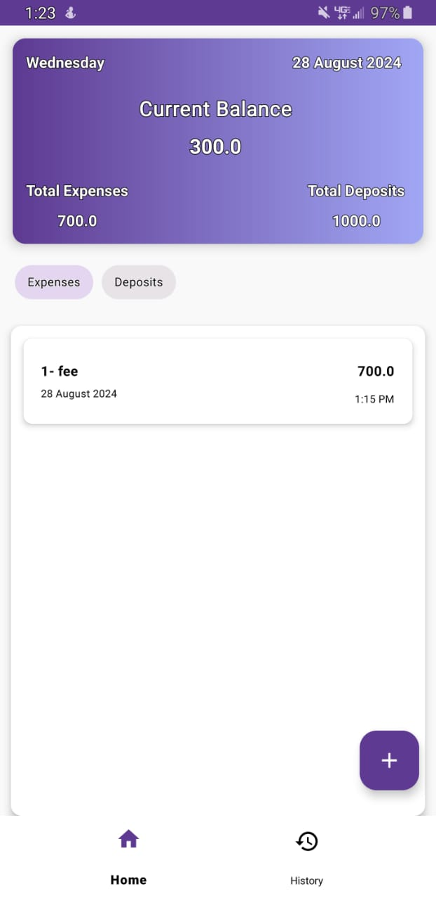
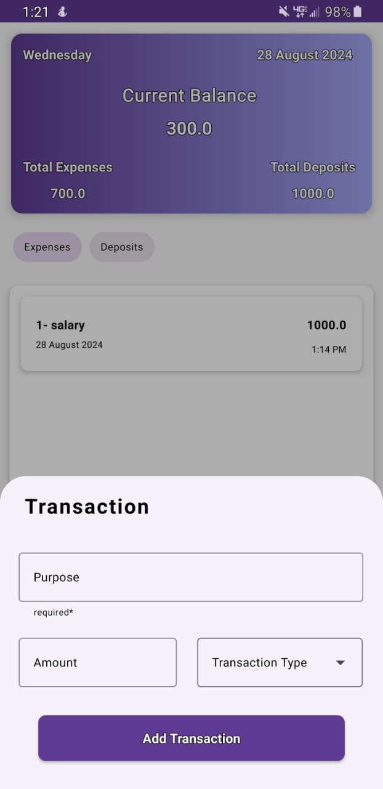

## Expense Tracker

### Overview

The **Expense Tracker** app is an advanced Android application for managing and tracking financial transactions. Utilizing Room database and MVVM architecture, this app provides an efficient way to handle financial data with a user-friendly interface and robust local storage.

### Key Features

- **User Authentication:**
  - Secure sign-up and sign-in functionalities.

- **Transaction Management:**
  - Create, categorize, and view transactions.
  - Detailed views and updated summaries.

- **Local Storage:**
  - Persistent transaction storage using Room.

- **User Interface:**
  - Clean and intuitive design.

- **Item Management:**
  - **Current Month Transactions:**
    - **Delete:** Double-click on a transaction to remove it.
    - **Update:** Single-click to modify details.
  - **History Management:**
    - Delete all records for a specific month.

### Technologies

- **Kotlin:** Main programming language.
- **XML:** UI layout design.
- **Room:** Local database.
- **MVVM:** Architecture pattern.
- **Hilt:** Dependency injection.
- **Android Studio:** IDE for development.

### Screenshots

<p>
  
  
  
  
  
  
</p>
### Installation

To set up the project locally, follow these steps:

1. **Clone the Repository:**

   ```sh
   git clone https://github.com/awais1019/Expense-Tracker.git
   ```

2. **Open the Project in Android Studio:**

   - Launch Android Studio.
   - Select "Open an existing Android Studio project."
   - Navigate to the cloned repository and select it.

3. **Build the Project:**

   - Android Studio will automatically download the necessary dependencies.
   - Click "Build" > "Make Project" or press `Ctrl+F9`.

4. **Run the App:**
   - Connect an Android device or start an emulator.
   - Click "Run" > "Run 'app'" or press `Shift+F10`.


### Future Goals

- **Monthly Graphs:** Introduce graphical representation of monthly transactions for enhanced insights.

### Learning MVVM and Best Practices

The primary goal of this project is to learn and apply the MVVM (Model-View-ViewModel) architecture pattern in Android development. By structuring the application using MVVM, the project aims to:

- **Separate Concerns:** Clearly separate the UI (View), business logic (ViewModel), and data (Model) layers, promoting maintainability and testability.
- **Improve Code Organization:** Ensure that the application is organized in a way that makes it easier to manage and extend.
- **Follow Best Practices:** Adhere to modern Android development best practices for building scalable and maintainable applications.

### Contributing

Contributions are welcome! If you have suggestions or improvements, please open an issue or submit a pull request.

### Contact Information

For any questions or feedback, please contact:

- **Email:** mhawais504@gmail.com
- **GitHub:** [awais1019](https://github.com/awais1019)
